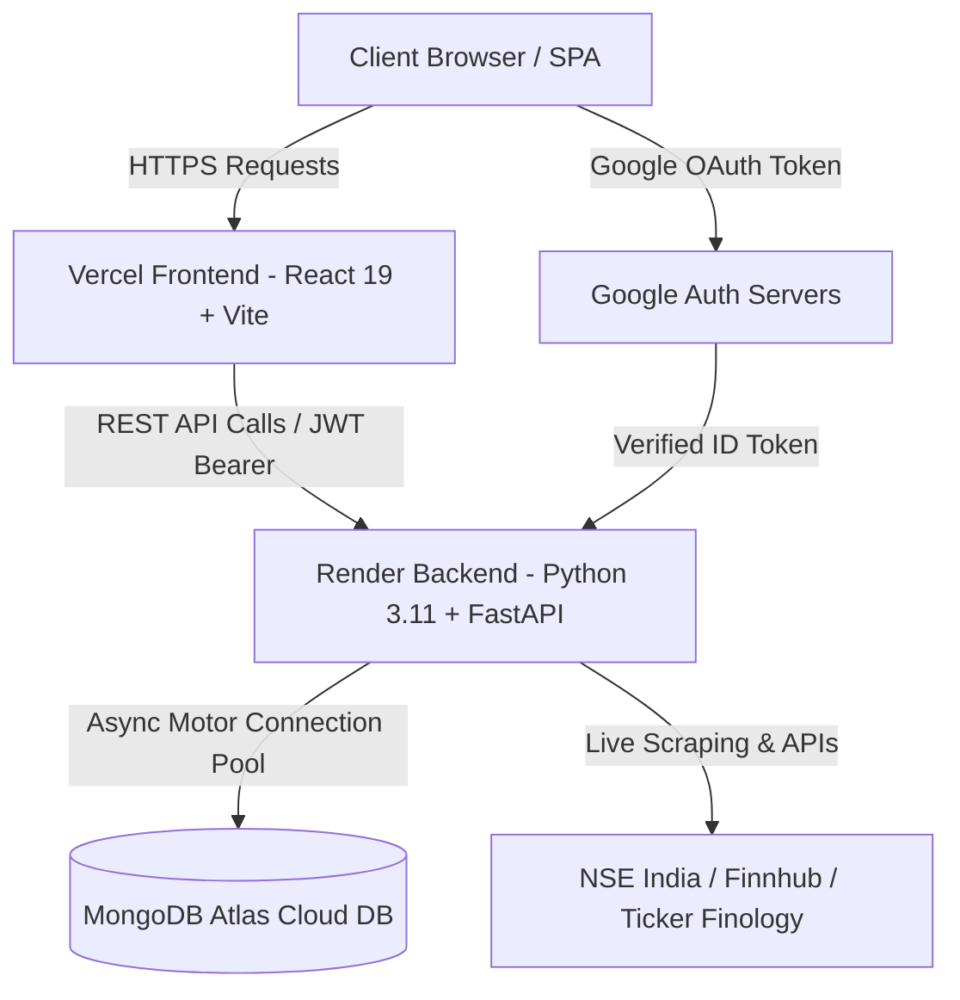

<div align="center">

  # 📈 KREO (SmartStocks)
  ### Next-Gen Indian Stock Analysis, IPO GMP Tracker & Fundamental Scoring Platform

  [](https://react.dev/)
  [](https://fastapi.tiangolo.com/)
  [](https://www.python.org/)
  [](https://www.mongodb.com/atlas)
  [](https://vitejs.dev/)
  [](./LICENSE)

  <p align="center">
    <b>A full-stack, real-time Indian stock market platform built for retail investors.</b><br />
    Includes automated fundamental scoring, live NSE Grey Market Premium (GMP) tracking, Fear & Greed index, stock screeners, watchlists, portfolio management, and JWT / Google OAuth 2.0 authentication.
  </p>

  [Live Demo](https://kreo.vercel.app) • [Report Bug](https://github.com/Kartikeyjindal/kreo/issues) • [Request Feature](https://github.com/Kartikeyjindal/kreo/issues)

</div>

---

## 🚀 System Architecture



---

## ✨ Features Highlight

### 📊 1. Fundamental Analysis & Scoring Algorithm
- **100-Point Metric Evaluation**: Automatically scores stocks across 8 fundamental pillars:
  - **P/E Ratio** (Price to Earnings valuation check)
  - **P/B Ratio** (Price to Book value analysis)
  - **ROE %** (Return on Equity efficiency)
  - **ROCE %** (Return on Capital Employed)
  - **Sales Growth %** (Top-line revenue trajectory)
  - **Profit Growth %** (Bottom-line earnings quality)
  - **EPS** (Earnings Per Share profitability)
  - **Dividend Yield %** (Income return metrics)
- **Verdict Tiers**: Automatically assigns glowing status badges:
  - 🟢 **Strong Buy** (Score 80–100)
  - 🟢 **Buy** (Score 65–79)
  - 🟡 **Hold** (Score 45–64)
  - 🔴 **Sell** (Score 30–44)
  - 🔴 **Strong Sell** (Score 0–29)

### 🇮🇳 2. Live IPO & Grey Market Premium (GMP) Tracker
- **Real-Time Bidding Demand**: Auto-fetches live subscription numbers (Retail, QIB, NII, Total) directly from NSE India API.
- **GMP Gains Estimation**: Dynamic calculation of listing day gain percentages, expected listing prices, and strategic verdicts (*Strong Listing Gains*, *Moderate Listing Gains*, *Hold Long-Term*, *Avoid*).
- **Issue Breakdown**: Visual percentage split of **Fresh Issue** vs **Offer for Sale (OFS)** capital allocation.
- **Historical Analysis**: Tracks past IPO performance (e.g. Tata Technologies, Swiggy, Hyundai Motor, Mankind Pharma) with actual vs issue price statistics.

### 😱 3. Market Sentiment & Sector Heatmap
- **Fear & Greed Index Gauge**: Custom visual gauge reflecting market sentiment (Extreme Fear to Extreme Greed).
- **Sector Heatmap**: Live tracking of sector strength across IT, Banking, Auto, Pharma, Defense, and Infrastructure.

### 📋 4. Watchlists & Portfolio Tracking
- **Multi-Watchlist Management**: Create, rename, delete, and add stocks to custom watchlists.
- **Portfolio P&L**: Track bought stock quantities, average buy prices, current market values, and net returns.
- **Price Target Alerts**: Set price thresholds with "Alert Above" or "Alert Below" notification triggers.

### 🔐 5. Dual Authentication & Dark Glassmorphism UI
- **JWT & Google OAuth 2.0**: Seamless authentication via standard email credentials or one-click Google Sign-In.
- **Modern Dark Theme**: Styled with a dark glassmorphism aesthetic, custom backdrop blurs, HSL color palettes, and Google Inter typography.

---

## 🛠️ Tech Stack & Dependencies

| Component | Technology | Description |
|---|---|---|
| **Frontend Framework** | `React 19` | Modern UI rendering with React Router DOM v6 |
| **Build Tool** | `Vite 6` | Next-generation fast frontend bundling |
| **Backend Framework** | `FastAPI` | Asynchronous Python REST API framework |
| **Server Engine** | `Uvicorn` | ASGI server for high-concurrency async Python |
| **Database** | `MongoDB Atlas` | Cloud NoSQL database with `Motor` async driver |
| **Auth & Security** | `JWT` + `Passlib` + `Google Auth` | Cryptographic password hashing (Bcrypt 4.0.1) & JWT tokens |
| **Data Processing** | `Pandas` + `BeautifulSoup4` + `Requests` | Data wrangling and web scraping |

---

## 📁 Repository Structure

```text
kreo/
├── backend/
│   ├── main.py                   # FastAPI application routes & endpoints
│   ├── db.py                     # Singleton MongoDB Motor client connection
│   ├── fundamental_scoring.py    # 100-point fundamental analysis engine
│   ├── ipo_service.py            # NSE live IPO GMP feed & historical data
│   ├── scraping.py               # Financial ratios web scraping service
│   └── requirements.txt          # Python backend dependencies
├── frontend/
│   ├── src/
│   │   ├── components/           # Navbar, FearGreedGauge, Watchlist, etc.
│   │   ├── pages/                # Home, StockView, IpoAnalysis, Screener, Alerts, Login
│   │   ├── context/              # AuthContext & WatchlistContext
│   │   └── App.jsx               # Primary application routes
│   ├── package.json              # React dependencies & scripts
│   └── vite.config.js            # Vite bundler configuration
└── README.md                     # Documentation
```

---

## ⚙️ Environment Variables Reference

### Backend (`backend/.env`)
```env
MONGO_URI=mongodb+srv://<user>:<password>@cluster0.mongodb.net/smartstocks?retryWrites=true&w=majority
JWT_SECRET=your_production_secret_key
GOOGLE_CLIENT_ID=your_google_client_id.apps.googleusercontent.com
FRONTEND_URL=https://kreo.vercel.app
FINNHUB_API_KEY=your_finnhub_key_optional
```

### Frontend (`frontend/.env`)
```env
VITE_API_BASE=https://kreo-5cuc.onrender.com
VITE_GOOGLE_CLIENT_ID=your_google_client_id.apps.googleusercontent.com
```

---

## 💻 Local Development Setup

### Prerequisites
- **Node.js**: v18.0.0 or higher
- **Python**: v3.10 or v3.11
- **Git**

### 1. Clone the Repository
```bash
git clone https://github.com/Kartikeyjindal/kreo.git
cd kreo
```

### 2. Backend Setup
```bash
cd backend

# Create & activate a Python virtual environment
python3 -m venv venv
source venv/bin/activate    # On Windows: venv\Scripts\activate

# Install dependencies
pip install -r requirements.txt

# Create backend/.env with your environment variables
cp sample.txt .env   # Or create .env manually

# Start the FastAPI dev server
uvicorn main:app --reload --port 8000
```
*Backend will be running at `http://localhost:8000` (API Docs at `http://localhost:8000/docs`).*

### 3. Frontend Setup
```bash
cd ../frontend

# Install dependencies
npm install

# Create a frontend/.env file:
VITE_API_BASE=http://localhost:8000
VITE_GOOGLE_CLIENT_ID=your_google_client_id.apps.googleusercontent.com

# Start the Vite dev server
npm run dev
```
*Frontend will be running at `http://localhost:5173`.*

---

## 🌐 Production Deployment

### Backend on Render
1. Create a **Web Service** on [Render.com](https://render.com).
2. Connect repository `Kartikeyjindal/kreo`.
3. Set **Root Directory**: `backend`.
4. Set **Build Command**: `pip install -r requirements.txt`.
5. Set **Start Command**: `uvicorn main:app --host 0.0.0.0 --port $PORT`.
6. Set **Environment Variable**: `PYTHON_VERSION` = `3.11.9`.
7. Add `MONGO_URI`, `JWT_SECRET`, `GOOGLE_CLIENT_ID`, `FRONTEND_URL`.

### Frontend on Vercel
1. Import repository `Kartikeyjindal/kreo` on [Vercel.com](https://vercel.com).
2. Set **Framework Preset**: `Vite`.
3. Set **Root Directory**: `frontend`.
4. Set **Environment Variable**: `VITE_API_BASE` = `https://your-backend.onrender.com`.
5. Click **Deploy**.

---

## 🤝 Contributing

Contributions, issues, and feature requests are welcome!  
Feel free to check the [issues page](https://github.com/Kartikeyjindal/kreo/issues).

---

## 👤 Author

**Kartikey Jindal**
- GitHub: [@Kartikeyjindal](https://github.com/Kartikeyjindal)
- LinkedIn: [Kartikey Jindal](https://linkedin.com/in/kartikey-jindal)

---

## 📄 License

This project is licensed under the [MIT License](./LICENSE) - see the LICENSE file for details.
